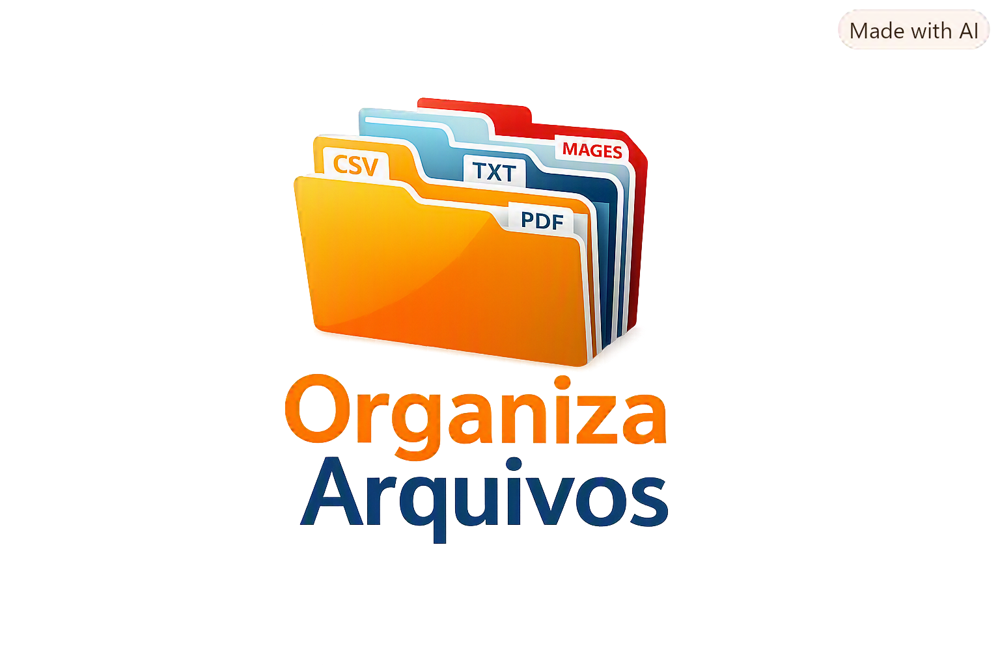

# 📂 Organizador de Arquivos com Python



Projeto desenvolvido em Python para **organizar automaticamente arquivos de uma pasta**, separando-os em subpastas de acordo com suas extensões.

O programa identifica arquivos `.CSV`, `.TXT`, `.PDF`, `.JPG` e `.PNG` e os move para pastas específicas, deixando o diretório de origem mais organizado.

---

## 🚀 Funcionalidades

- Solicita ao usuário o caminho da pasta que será organizada.
- Lista os arquivos existentes na pasta.
- Identifica o tipo de arquivo pela extensão.
- Cria automaticamente as pastas de destino quando necessário.
- Move os arquivos para suas respectivas pastas.
- Informa no terminal quais arquivos foram movidos.
- Informa quando encontra um formato que não é suportado.

### Organização realizada

| Extensão | Pasta de destino |
|---|---|
| `.csv` | `CSV` |
| `.txt` | `TXT` |
| `.pdf` | `PDF` |
| `.jpg` | `IMAGES` |
| `.png` | `IMAGES` |

---

## 🗂️ Exemplo

### Antes de executar

```text
minha_pasta/
├── vendas.csv
├── clientes.csv
├── contrato.pdf
├── anotacoes.txt
├── foto.jpg
└── imagem.png
```

### Depois de executar

```text
minha_pasta/
├── CSV/
│   ├── vendas.csv
│   └── clientes.csv
├── TXT/
│   └── anotacoes.txt
├── PDF/
│   └── contrato.pdf
└── IMAGES/
    ├── foto.jpg
    └── imagem.png
```

---

## 🛠️ Tecnologias utilizadas

- **Python 3**
- `os` — utilizado para trabalhar com caminhos, listar arquivos e criar diretórios.
- `shutil` — utilizado para mover os arquivos.

Não são necessárias bibliotecas externas.

---

## 📋 Pré-requisitos

Tenha o Python instalado no computador.

Para verificar a instalação:

```bash
python --version
```

Ou, dependendo da configuração do Windows:

```bash
py --version
```

---

## ▶️ Como executar

1. Clone ou baixe este projeto.
2. Abra o projeto no VS Code, Jupyter Notebook ou outro ambiente Python.
3. Execute o programa.
4. Quando solicitado, informe o caminho da pasta que deseja organizar.

Exemplo:

```text
Informe o caminho da Pasta: C:\Users\Usuario\Downloads\Arquivos
```

O programa criará automaticamente as pastas necessárias e moverá os arquivos encontrados.

---

## 💻 Código principal

```python
import shutil
import os

pasta_origem = str(input("Informe o caminho da Pasta: "))

arquivos = os.listdir(pasta_origem)

for arquivo in arquivos:

    if arquivo.endswith('.csv'):
        pasta = "CSV"

    elif arquivo.endswith('.txt'):
        pasta = "TXT"

    elif arquivo.endswith('.pdf'):
        pasta = "PDF"

    elif arquivo.endswith(('.jpg', '.png')):
        pasta = "IMAGES"

    else:
        print(f"Arquivo {arquivo} não é suportado e não será movido.")
        continue

    pasta_destino = os.path.join(pasta_origem, pasta)

    os.makedirs(pasta_destino, exist_ok=True)

    shutil.move(
        os.path.join(pasta_origem, arquivo),
        pasta_destino
    )

    print(f"Arquivo {arquivo} movido para a pasta {pasta}.")
```

---

## 🧠 O que este projeto demonstra

Este projeto é um exercício prático de automação com Python e trabalha conceitos importantes como:

- Variáveis
- Entrada de dados com `input()`
- Estruturas condicionais `if`, `elif` e `else`
- Laço de repetição `for`
- Manipulação de strings
- Tuplas
- Manipulação de arquivos e diretórios
- Caminhos com `os.path`
- Criação de diretórios com `os.makedirs()`
- Movimentação de arquivos com `shutil.move()`
- Tratamento de formatos não suportados

---

## ⚠️ Observações

- Faça um backup dos arquivos importantes antes de testar o programa.
- O programa move os arquivos da pasta original para as subpastas.
- Arquivos com extensões diferentes das configuradas não serão movidos.
- O código considera atualmente `.csv`, `.txt`, `.pdf`, `.jpg` e `.png`.
- Em sistemas Windows, caminhos podem ser informados usando `\` ou, em muitos casos, uma string com `/`.

---

## 🔧 Possíveis melhorias

Este projeto pode evoluir para um organizador mais completo. Algumas ideias:

- [ ] Adicionar suporte para `.xlsx` e `.docx`
- [ ] Adicionar suporte para arquivos `.jpeg`
- [ ] Organizar arquivos por data
- [ ] Criar uma interface gráfica
- [ ] Permitir selecionar a pasta com uma janela
- [ ] Criar um relatório dos arquivos movimentados
- [ ] Evitar conflitos quando já existir um arquivo com o mesmo nome
- [ ] Adicionar opção para desfazer a organização
- [ ] Registrar as operações em um arquivo de log
- [ ] Transformar o projeto em uma aplicação executável (`.exe`)

---

## 📌 Objetivo do projeto

O objetivo é praticar **Python aplicado à automação de tarefas**, criando uma solução simples e útil para organização de arquivos.

Este projeto também pode servir como base para projetos maiores de automação de tarefas repetitivas.

---

## 👩‍💻 Aprendizado

Projeto desenvolvido como parte dos estudos de Python e automação, com foco em transformar conhecimentos de programação em soluções práticas para o dia a dia.

---

## 📄 Licença

Este projeto pode ser utilizado para fins de estudo e aprendizado.
